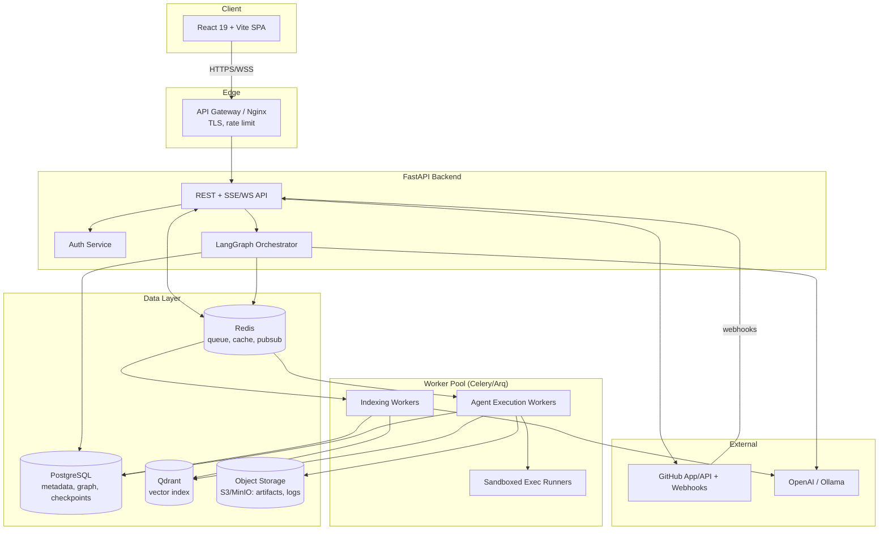
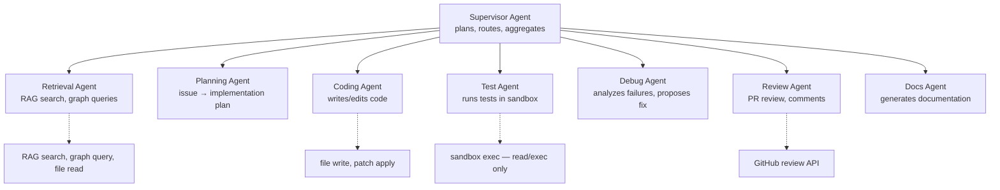
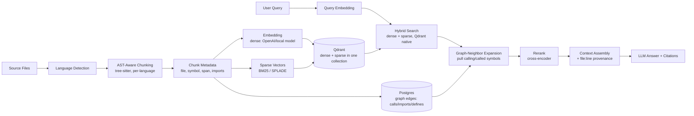
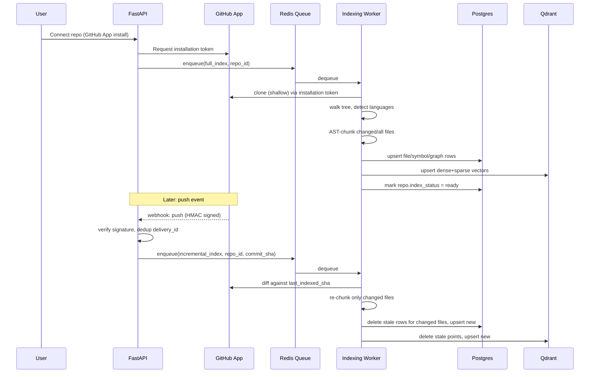
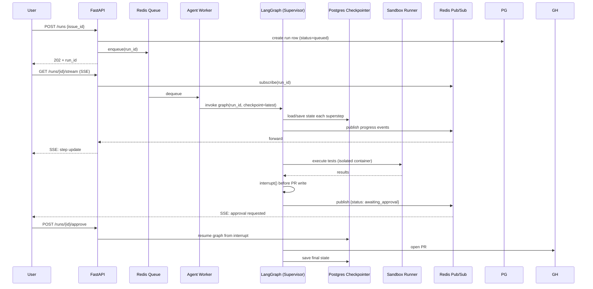
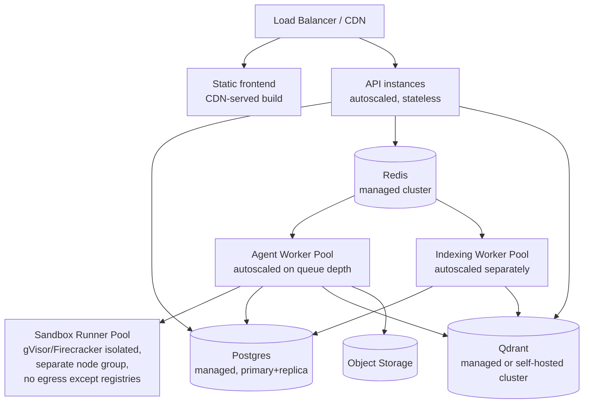

# Lumora — System Architecture

## Context

Lumora is greenfield (repo has only a README stub). The goal of this task is a
**design-only** deliverable: a production-grade architecture for an autonomous
AI software engineering platform (repo understanding, RAG-based Q&A with
citations, issue-to-PR implementation, PR review, test execution, autonomous
debugging, documentation generation, cross-session memory, multi-agent
orchestration) with a modern SaaS frontend. No code or project scaffolding is
created in this task — that begins only after this plan is approved.

Because the brief explicitly asks for reasoning, alternatives, and trade-offs
per decision (not just a recommendation), this document is intentionally long
and opinionated. Where a decision materially forks the rest of the
architecture, it's called out and resolved explicitly rather than left open.

Two forks resolved up front because everything downstream depends on them:

- **Knowledge graph storage**: the stack lists Postgres/Redis/Qdrant only,
  with no graph database. Resolution: model the graph as edge tables in
  Postgres (recursive CTEs), not a 4th datastore — see §8.
- **Long-running agent work**: PR generation / debugging runs can take
  minutes. Resolution: these cannot live inside an HTTP request/response
  cycle — they run as durable, resumable background jobs with a LangGraph
  Postgres checkpointer, streamed to the client over SSE — see §7.

---

## 1. High-Level Architecture



**Why this shape**: separates the request-serving path (FastAPI, must stay
fast) from long-running/untrusted work (worker pool, can be slow and must be
sandboxed). Redis is the single coordination point (queue + pub/sub for
streaming progress + cache), which keeps the infra surface small for a v1
team. Alternative considered: a dedicated message broker (RabbitMQ/Kafka) —
rejected for v1 as over-engineering; Redis Streams/Celery is sufficient until
throughput or delivery-guarantee needs (Kafka's durability/replay) actually
appear (see §13).

---

## 2. Frontend Architecture

**Stack**: React 19, TypeScript (strict), Vite, Tailwind v4, shadcn/ui, Framer
Motion, React Router, TanStack Query, Zustand.

**Structure**: feature-based, not layer-based —

```
src/
  app/            # router, providers, layout shell
  features/
    repos/        # repo list, connect, indexing status
    chat/         # RAG Q&A, citations
    issues/       # issue browser, plan preview
    pr-review/    # diff viewer, review comments
    agent-runs/   # live run timeline (SSE), approval gates
    settings/
  shared/
    components/   # shadcn-based primitives, truly cross-feature only
    hooks/
    lib/          # api client, ws client
    types/
```

**State boundary (a common React 19 mistake to prevent explicitly)**:
TanStack Query owns **all server state** (repos, runs, messages, PR data) —
it already gives caching, retry, invalidation. Zustand owns **only
ephemeral client/UI state** (panel open/closed, active tab, draft input). If
a piece of state is fetched from or persisted to the backend, it does not
belong in a Zustand store, full stop — this avoids the classic dual-source-
of-truth bug where a Zustand copy of server data drifts from the Query cache.

**Real-time updates**: agent runs stream progress via SSE (not raw
WebSockets) — one-directional server→client event stream fits this use case,
is simpler to reconnect (`EventSource` auto-retries), and works through
standard HTTP infra/load balancers without special upgrade handling.
WebSockets are reserved for the one genuinely bidirectional feature: live
chat with mid-stream interrupt/steer. Alternative considered: WebSockets for
everything — rejected, unnecessary complexity for one-way progress feeds.

**Accessibility & perf**: shadcn/ui (Radix primitives) gives correct
ARIA/focus-trap behavior for free; virtualize long lists (chat history, diff
viewers, log tails) with `@tanstack/react-virtual`; code-split each feature
route.

---

## 3. Backend Architecture

**Stack**: Python, FastAPI, LangGraph, LangChain (thin usage — see note
below).

**Layering (Clean Architecture / hexagonal)**:

```
backend/
  api/            # FastAPI routers — HTTP/SSE only, no business logic
  domain/         # entities, value objects, domain services (pure Python)
  application/    # use cases / orchestration (calls domain + ports)
  infrastructure/ # Postgres repos, Qdrant client, GitHub client, LLM clients
  agents/         # LangGraph graphs, nodes, tools
  workers/        # Celery/Arq task definitions
  core/           # config, DI container, logging, security
```

Dependency direction: `api → application → domain`, with `infrastructure`
implementing ports defined in `domain`/`application` (dependency inversion) —
domain code never imports FastAPI or a DB driver directly, which is what
makes agent logic and business rules unit-testable without spinning up
Postgres/Qdrant.

**Why FastAPI**: native async, Pydantic v2 for request/response + LLM
structured-output validation (one validation model, two uses), automatic
OpenAPI schema (contract for the TS frontend via codegen — see §10).

**Why LangGraph over raw LangChain chains**: agent workflows here are
stateful, cyclic, and need durable checkpoints + human-in-the-loop
interrupts (approve this PR plan before it writes code) — LangGraph's graph
model with a Postgres checkpointer supports pause/resume/branch natively;
LangChain's linear chain abstraction doesn't. LangChain is still used, but
narrowly — document loaders and a handful of retriever interfaces — not as
the orchestration layer. Alternative considered: hand-rolled state machine —
rejected, reinvents checkpointing/streaming/interrupt handling LangGraph
already provides.

**Type safety**: `mypy --strict`, Pydantic v2 models at every boundary
(API in/out, LLM structured output, DB row mapping via SQLModel or
SQLAlchemy 2.0 typed ORM).

---

## 4. AI Agent Architecture

Multi-agent, supervisor-coordinated, LangGraph-based. Each specialist agent
is a subgraph with a narrow tool surface — this is a security/reliability
boundary as much as a design one: the code-writing agent should not hold
GitHub-write credentials, and the PR-commenting agent should not hold
shell-execution access.



- **Supervisor pattern** (not fully decentralized swarm): one agent owns
  planning/routing and maintains the shared task graph; specialists report
  back structured results. Alternative considered: decentralized agent-to-
  agent handoff (e.g. AutoGen-style) — rejected for v1: harder to bound cost,
  harder to reason about failure, harder to insert human-approval gates at a
  single, predictable point.
- **Tool scoping per agent** enforces least privilege — this is the same
  principle as scoped IAM roles, applied to agents instead of services.
- **Human-in-the-loop gate**: before Coding Agent commits changes or Review
  Agent posts to GitHub, LangGraph `interrupt()` pauses the graph and the
  frontend surfaces an approval UI (agent-runs feature, §2). This is a
  product-safety requirement (users should approve autonomous PR writes to
  their repos, at least in v1) as much as an architectural one.
- **Model routing**: OpenAI (hosted, best reasoning) drives planning, coding,
  and debugging — tasks where reasoning quality dominates cost. Ollama
  (local) handles cheap/high-volume, latency-tolerant work: embeddings
  generation and lightweight classification (e.g., "does this file need
  re-indexing"). This is stated explicitly because "we use both OpenAI and
  Ollama" is not itself an architecture — the split must be justified per
  task, and each task type should carry a per-tenant token/cost budget
  enforced in the application layer, not left to LLM-provider dashboards.
- **MCP**: exposed both directions — Lumora's own tools (repo search, sandbox
  exec) are wrapped as MCP servers so agents (and, later, external MCP
  clients like Claude Code itself) can call them uniformly; Lumora can also
  consume external MCP servers (e.g., a user's internal Jira MCP) as
  additional agent tools without bespoke integration code per service.

---

## 5. RAG Pipeline

This is the highest-leverage correctness decision in the system — get
retrieval wrong and every downstream feature (Q&A, planning, review) degrades
silently.



- **Chunking**: AST-aware via `tree-sitter` grammars per language (function/
  class/method as the natural chunk boundary, with a sliding-window fallback
  for very large functions and non-code files like Markdown/config). Fixed-
  size character chunking (naive RAG default) is explicitly rejected — it
  routinely splits a function signature from its body, which both breaks
  retrieval relevance and produces citations that don't correspond to a
  coherent unit of code.
- **Metadata per chunk**: file path, symbol name, start/end line, language,
  containing class/module, git blob SHA, content hash. This is what makes
  "answer with source citations" possible — citations are a byproduct of
  storing provenance at index time, not a feature bolted on at query time.
- **Retrieval is hybrid, not dense-only**: dense embeddings capture semantic
  similarity but miss exact identifier/error-string matches that developers
  actually search for; sparse (BM25/SPLADE) covers that gap. Qdrant supports
  named sparse vectors in the same collection/point, so this doesn't require
  a second vector store — just a second vector field and a fusion query
  (e.g. RRF) at search time.
- **Graph-neighbor expansion**: after hybrid search returns top-K chunks,
  expand using the Postgres call/import graph (§8) to pull directly-
  related symbols (callers, callees, same-file siblings) before reranking —
  this is what lets the system answer "what calls this function" or "trace
  this code path" questions that pure similarity search cannot.
- **Rerank**: a cross-encoder pass (e.g. a small local reranker, or an LLM-
  as-reranker for the top ~20) over the combined candidate set before final
  context assembly — cheap relative to generation, meaningfully improves
  precision.
- **Eval harness, designed in from milestone 1**: a curated set of
  `(query, expected file/chunk)` pairs per indexed repo, run as a regression
  suite whenever chunking/embedding/retrieval logic changes. Without this,
  there's no way to tell whether a retrieval change is an improvement or a
  regression — it must exist before the pipeline is tuned, not after.

---

## 6. Repository Indexing Workflow



- **Incremental re-indexing is not optional**: repos change on every push;
  full re-index per push doesn't scale past a handful of repos and directly
  shapes the schema (needs `last_indexed_sha` and per-file content hashes,
  §8). Re-index is scoped to the git diff, keyed on blob SHA + chunk content
  hash so unchanged chunks are never re-embedded (embedding calls are the
  dominant cost).
- **Webhook correctness**: verify GitHub's HMAC signature on every webhook;
  dedup on `X-GitHub-Delivery` id (GitHub redelivers on timeout, and without
  dedup a slow worker causes duplicate indexing jobs).
- **Access model**: GitHub App installation (not user OAuth) — see §9 for
  why.

---

## 7. Agent Orchestration Workflow

The core problem this section solves: an issue-to-PR run can take minutes,
involve multiple LLM calls and tool executions, must be resumable if a
worker restarts, and must support a human pausing it mid-run to approve or
redirect. None of that fits inside a single HTTP request.



- **Durable queue + worker pool** (Celery or Arq on Redis): the API process
  only enqueues and returns immediately (202 + run id) — it never blocks on
  agent execution. Alternative considered: background `asyncio` tasks inside
  the FastAPI process — rejected, doesn't survive a process restart and
  doesn't scale horizontally independent of the API.
- **LangGraph Postgres checkpointer** is what makes runs resumable across
  worker restarts/deploys, and is also the mechanism that satisfies
  "remembers project context across sessions" — checkpoint state per
  repo/thread is the durable memory, not an ad-hoc cache.
- **Sandboxed execution** (Test Agent, and any Debug Agent code execution)
  runs in ephemeral, isolated containers, separate from the API and worker
  processes — no host filesystem mounts beyond the checked-out repo,
  dropped Linux capabilities, network egress allowlist (package registries
  only, no arbitrary outbound), CPU/memory/wall-clock limits enforced by the
  container runtime. This is a hard requirement, not an optimization:
  "execute tests autonomously" on repos Lumora doesn't own means running
  untrusted code by definition, and it's what justifies giving sandbox
  runners their own worker pool (§12) rather than sharing the agent-worker
  pool.
- **Streaming**: LangGraph node-level events published to Redis pub/sub,
  forwarded to the client over the SSE connection opened in §2.
- **Approval gate**: `interrupt()` pauses the graph durably (state is
  checkpointed, not held in memory) until `POST /runs/{id}/approve` resumes
  it — the worker process handling the resume doesn't need to be the same
  one that hit the interrupt.

---

## 8. Database Schema

**Design decision — knowledge graph lives in Postgres, not a separate graph
DB.** Alternative considered: Neo4j/Memgraph for the code graph. Rejected for
v1: the graph queries this product needs (callers/callees, import chains,
symbol-defines-symbol, N-hop neighbor expansion for RAG context, §5) are
well served by adjacency-list edge tables + recursive CTEs at the scale of a
single repo's symbol graph (thousands to low tens-of-thousands of nodes,
not the internet). Adding a 4th datastore multiplies operational surface
(backup, HA, another driver, another failure mode) for a win that only
materializes at cross-repo, million-node scale. Revisit only if/when
cross-repo graph traversal or graph algorithms (community detection,
centrality) become an actual product feature — see §13.

**PostgreSQL — core tables** (illustrative, not exhaustive DDL):

```
organizations(id, name, plan, created_at)
users(id, org_id, email, github_user_id, created_at)
repos(id, org_id, github_repo_id, full_name, default_branch,
      last_indexed_sha, index_status, installation_id)
files(id, repo_id, path, language, content_hash, blob_sha, updated_at)
symbols(id, file_id, name, kind, start_line, end_line, signature)
symbol_edges(id, src_symbol_id, dst_symbol_id, edge_type)
  -- edge_type: calls | imports | defines | inherits | references
  -- this table + recursive CTE = the "knowledge graph"
chunks(id, file_id, symbol_id?, content_hash, start_line, end_line,
       qdrant_point_id)
issues(id, repo_id, github_issue_id, title, body, status)
runs(id, repo_id, issue_id?, status, langgraph_thread_id, created_by,
     created_at, completed_at)
run_events(id, run_id, seq, type, payload_json, created_at)  -- audit trail
pr_reviews(id, run_id, github_pr_id, status)
checkpoints / checkpoint_writes  -- LangGraph's own Postgres checkpointer tables
webhook_deliveries(id, github_delivery_id UNIQUE, received_at)  -- dedup
```

Row-Level Security (RLS) policies keyed on `org_id` enforce tenant isolation
at the database layer (§9) — not just in application code — so a query
bug in one endpoint can't leak cross-tenant rows.

**Qdrant**: one collection per environment (not per tenant/repo) — points
carry `org_id`/`repo_id` in payload with a payload index, filtered at query
time. Alternative considered: collection-per-tenant — better hard isolation,
but collection-per-tenant stops scaling once tenant count reaches the
thousands (collection overhead, harder cross-tenant admin ops); payload-
filtered single collection is the standard Qdrant multi-tenancy pattern and
is what's recommended for a SaaS with an open-ended tenant count. Each point
stores both a dense vector and a named sparse vector (§5), plus
`chunk_id`/`file_id` back-reference to Postgres.

**Redis**: task queue (Celery/Arq broker + result backend), pub/sub for run
event streaming, and a cache layer (session lookups, hot repo metadata) —
three uses of one system, acceptable at this scale, split out only if
contention between queue and cache traffic actually appears (§13).

**Object storage (S3/MinIO)**: large artifacts that don't belong in Postgres
— test logs, sandbox stdout/stderr captures, generated diffs/patches.
Postgres stores a reference (`s3://...`), not the blob.

---

## 9. Authentication Strategy

**Two distinct auth concerns, deliberately separated:**

1. **User → Lumora**: standard session auth for the SaaS product itself.
   OAuth via GitHub (matches the target audience — developers already have
   GitHub accounts, and it doubles as identity verification for repo
   access) plus email/password as a fallback, issuing short-lived JWT access
   tokens + httpOnly-cookie refresh tokens. Alternative considered: a full
   external IdP (Auth0/Clerk) — reasonable and arguably faster to ship;
   recommended if the team is small and wants to buy rather than build
   session/MFA/password-reset flows. Rolling it in-house is only justified
   if avoiding a per-MAU vendor cost is a stated priority.

2. **Lumora → GitHub (repo access)**: a **GitHub App** installation, not
   user OAuth-scoped tokens. This is a hard recommendation, not a stylistic
   choice: GitHub Apps get short-lived installation tokens scoped to exactly
   the repos/permissions granted (fine-grained: contents, issues, pull-
   requests, checks), support webhook event delivery (needed for §6's
   incremental indexing), and don't tie repo access to a single user's
   personal OAuth token going stale or that user leaving the org. User
   OAuth tokens (the alternative) are broader-scoped, tied to a person, and
   have no first-class webhook story — wrong fit for a background agent
   that needs durable, org-owned repo access.

**Multi-tenancy**: every request resolves to an `org_id` from the session;
Postgres RLS policies (§8) enforce it at the data layer as defense in depth
alongside application-layer checks. GitHub App installation tokens and any
LLM API keys are encrypted at rest (e.g. via a KMS-backed envelope
encryption scheme), never logged, never returned to the frontend.

**Authorization**: role-based (owner/admin/member) at the org level to
start; resource-level checks (can this user approve this run / view this
repo) enforced in the application layer. Full ABAC/policy-engine (e.g.
OpenFGA) is future scope (§13) — not justified until permission requirements
get more granular than org-role.

---

## 10. API Structure

**REST + SSE**, versioned from day one (`/api/v1/...`) — cheap insurance
against breaking the frontend or future third-party integrators on the first
schema change.

```
/api/v1/auth/...              session, GitHub OAuth callback
/api/v1/orgs/{id}/...
/api/v1/repos                 GET list, POST connect (GitHub App install)
/api/v1/repos/{id}            GET, DELETE
/api/v1/repos/{id}/reindex    POST (manual trigger)
/api/v1/repos/{id}/chat       POST — RAG Q&A (or /chat/stream for SSE tokens)
/api/v1/repos/{id}/issues     GET (synced from GitHub)
/api/v1/runs                  POST create (issue_id → plan+implement run)
/api/v1/runs/{id}             GET status
/api/v1/runs/{id}/stream      GET (SSE — progress events)
/api/v1/runs/{id}/approve     POST (resume from interrupt)
/api/v1/runs/{id}/reject      POST
/api/v1/pr-reviews            POST trigger review on a PR
/webhooks/github               POST (HMAC-verified, not under /api/v1)
```

**Contract sharing**: FastAPI's generated OpenAPI schema drives TypeScript
client/type generation (`openapi-typescript` or similar) for the frontend —
one source of truth for request/response shapes, no hand-maintained duplicate
types drifting between backend and frontend.

**Streaming endpoints** use SSE (`text/event-stream`) for run progress and
chat token streaming — plain HTTP, works with standard reverse proxies,
auto-reconnecting client-side. A dedicated WebSocket endpoint is added only
for the interruptible chat case (§2).

**Errors**: RFC 7807 `application/problem+json` structured errors
consistently across the API, so the frontend has one error-shape to handle.

---

## 11. Folder Structure

Monorepo (frontend + backend + infra together) — justified at this stage by
tight coupling between the OpenAPI-generated contract and shared deploy
tooling; split into separate repos later only if independent release cadence
or separate-team ownership actually demands it (§13).

```
lumora/
  apps/
    web/                  # React frontend (see §2 for internal structure)
    api/                  # FastAPI backend (see §3 for internal structure)
  packages/
    shared-types/         # generated OpenAPI TS types, shared enums
  infra/
    docker/               # Dockerfiles per service
    docker-compose.yml     # local dev: postgres, redis, qdrant, minio
    k8s/  (or terraform/)  # prod manifests (§12)
    github-actions/        # CI workflow definitions
  docs/
    architecture/          # this doc, ADRs for future decisions
  .github/workflows/
```

Backend and frontend each own their own lint/type-check/test config; CI runs
them independently so a frontend-only change doesn't wait on backend test
suite and vice versa.

---

## 12. Deployment Architecture

**Local dev**: Docker Compose — Postgres, Redis, Qdrant, MinIO (S3-
compatible), API, worker(s), web (Vite dev server). One `docker compose up`
gets a full stack running, including a local sandbox runner image, so agent
runs are testable without hitting real GitHub.

**Production**:



- **Frontend**: static build behind a CDN — no server-side rendering need
  (this is an authenticated app dashboard, not content requiring SEO), which
  keeps the frontend deploy simple and cheap.
- **API**: stateless FastAPI instances behind the LB, horizontally
  autoscaled on request load — statelessness is why this works (session in
  JWT + Redis, no in-memory run state).
- **Worker pools are separated by workload type and scaled independently**:
  indexing workers scale on repo-connect/webhook volume; agent workers scale
  on run-queue depth; both are separate node groups from the API so a burst
  of indexing jobs can't starve request latency.
- **Sandbox runner pool is its own isolated node group** — this is the
  security-critical separation from §7 made concrete at the infra layer:
  gVisor or Firecracker microVM isolation (stronger boundary than bare
  Docker for running arbitrary/untrusted repo code), no host mount beyond
  the checked-out worktree, network egress locked to package registries,
  and ideally on nodes with no IAM/credentials that could reach the rest of
  the platform even if the sandbox were escaped.
- **Managed data services recommended over self-hosting** (RDS/Cloud SQL for
  Postgres, managed Redis, Qdrant Cloud or a dedicated Qdrant cluster) for a
  small team — trades cost for eliminating backup/HA/patching operational
  load; self-host only if/when the cost delta justifies dedicated infra
  ownership.
- **CI/CD**: GitHub Actions — lint/typecheck/test on PR, build+push
  container images on merge to main, deploy via the chosen orchestrator
  (k8s manifests or ECS task defs in `infra/`). Migrations (Alembic) run as
  a pre-deploy step, not inside app startup, so a bad migration fails the
  deploy rather than crash-looping live traffic.

---

## 13. Future Scalability Considerations

Flagged explicitly so v1 decisions aren't mistaken for permanent ones:

- **Graph database migration**: if cross-repo graph traversal or graph
  algorithms become a real feature, revisit §8's Postgres-CTE decision —
  Neo4j/Memgraph become justified once traversal depth or node count
  outgrows recursive CTE performance.
- **Message broker upgrade**: if delivery guarantees or replay-for-audit
  needs outgrow Redis Streams/Celery, migrate the queue (not the whole
  system) to Kafka/RabbitMQ — the worker interface should be broker-
  agnostic enough that this is a swap, not a rewrite.
- **Qdrant tenancy model**: revisit payload-filtered single collection
  (§8) if a small number of very large enterprise tenants need hard
  physical isolation (compliance-driven) — collection-per-large-tenant,
  shared collection for the long tail, is a reasonable hybrid.
- **Split the monorepo** if/when frontend and backend need independent
  release cadences or separate team ownership boundaries harden.
- **Redis workload separation**: split queue/pubsub/cache onto separate
  Redis instances if contention between them becomes measurable.
- **Read replicas / CQRS**: Postgres read replicas for the chat/dashboard
  read path once write load from indexing/checkpointing contends with read
  traffic.
- **Fine-grained authorization**: move from org-role RBAC to a policy engine
  (OpenFGA/Cedar) if per-repo or per-resource sharing rules get more complex
  than "member of org."
- **Multi-region**: only once there's a concrete latency or data-residency
  requirement — premature multi-region is a common over-engineering trap.
- **Self-hosted LLM scale-out**: if local-model (Ollama) usage grows beyond
  embeddings/classification into higher-volume inference, budget for a
  dedicated GPU node pool with a proper inference server (vLLM/TGI) rather
  than scaling Ollama directly.

---

## 14. Development Roadmap

Sequenced by **risk retired**, not by architectural layer — the riskiest,
least-proven parts of this system are code-RAG quality and sandboxed
execution, not auth or UI polish, so those come first as a thin vertical
slice before anything else is built out.

**M0 — Foundations** (infra skeleton, no product features)
Monorepo scaffold, Docker Compose dev stack, CI (lint/type/test), FastAPI
skeleton with health check, React skeleton with routing shell, GitHub App
registration.

**M1 — Vertical slice: index one repo → cited Q&A**
GitHub App install + clone, AST chunking (tree-sitter, 2–3 languages),
embedding + Qdrant hybrid index, symbol graph in Postgres, hybrid retrieval +
rerank, chat endpoint with citations, **retrieval eval harness** (§5) — this
milestone proves or disproves the core value proposition before anything
else is invested in.

**M2 — Incremental indexing + webhooks**
Webhook receipt/verification/dedup, diff-based re-index, index status UI.

**M3 — Issue understanding + planning agent**
Issue sync from GitHub, Planning Agent (issue → structured implementation
plan using RAG context), plan review UI — no code writing yet, so the
riskiest remaining piece (autonomous code changes) is still isolated.

**M4 — Sandboxed execution + Coding/Test agents**
Sandbox runner infra (isolated containers, resource limits), Coding Agent
(writes patches), Test Agent (runs in sandbox), Debug Agent (failure →
proposed fix loop), LangGraph checkpointing + interrupt/approval gate,
run-progress streaming (SSE) — this is the largest milestone and the
second major risk (agentic code-writing loop) retired.

**M5 — PR automation + review**
Coding Agent opens PRs via GitHub App, Review Agent (PR diff review +
comments), end-to-end issue→PR flow behind the approval gate from M4.

**M6 — Multi-tenancy + auth hardening + billing-readiness**
Org/user model, RLS policies, GitHub OAuth user login, per-tenant token
budgets, rate limiting — deliberately after the agent core works, since
auth/tenancy is well-understood engineering, not the part carrying product
risk.

**M7 — Docs generation + cross-session memory polish**
Docs Agent, long-term project memory surfaced in UI (leveraging LangGraph
checkpoint history, §7), settings/preferences.

**M8 — Production hardening + scale**
Load testing, autoscaling tuning for worker pools, observability
(structured logging, tracing across API→queue→worker→LLM calls, cost
dashboards per §4's model routing), revisit §13 items as real usage data
justifies them.

---

## Verification (once implementation begins)

- **M1 gate**: retrieval eval harness must hit a defined precision/recall
  threshold on the curated query set before M2 starts — this is the
  concrete, testable checkpoint that validates the RAG design in §5.
- **M4 gate**: an end-to-end dry run (real GitHub issue → generated PR on a
  disposable test repo) with the approval gate exercised manually, plus
  sandbox escape/resource-limit tests (attempt network egress, attempt to
  exceed CPU/memory/time limits, confirm all are blocked) before this
  milestone is considered done.
- Every milestone ships with its own automated test suite (unit tests for
  domain/application layers per §3, integration tests against the Compose
  stack) run in CI — no milestone is "done" without CI green.
